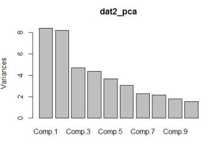
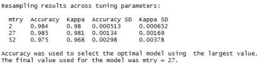
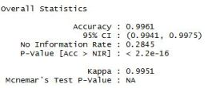
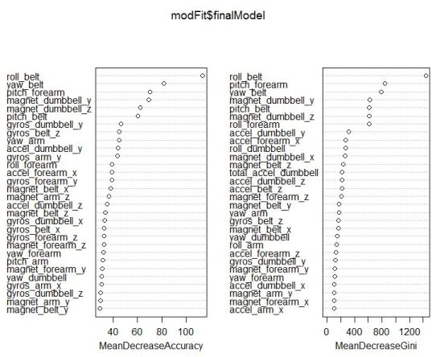

## Practical Machine Learning - Assignment

The goal of the assignment was to be able to predict reliably, the correctness with which the Weight-Lifting activity was being executed by the participant. The execution could belong to any of 5 classes - A (correct) or B,C,D,E (incorrect). 

### Preliminaries

A quick look at the data in MS Excel revealed 19622 observations of 159 variables. It also revealed the presence of a number of superfluous columns that were either empty or filled with NA values. These were easily removed and so were some other columns with unimportant information such as record number, name of participant etc. In this way, the dataset was whittled down to 52 predictor variables and the "classe" variable. 

### Creating Training and Testing sets

The data was stored into the dataframe *dat1*. 


```r
library(caret);
library(kernlab);
library(scatterplot3d);
dat=read.csv("pml-training.csv",header=TRUE)
dattemp<-dat[,!sapply(dat,function(x) any(is.na(x)))]
dat1<-dattemp[,!sapply(dattemp, function(x) any(x == ""))]
```

The *createDataPartition* was used to divide the dataset into the **training** and **testing** sets. 


```r
inTrain=createDataPartition(y=dat1$classe,p=0.70,list=FALSE)
training<-dat1[inTrain,]
testing<-dat1[-inTrain,]
```

A quick check using the *princomp* function reveals that factoring the variables may probably not be very useful here. 


```r
dat2_pca<-princomp(formula=~.-classe,data=training,cor=TRUE,na.action=na.exclude)
plot(dat2_pca)
```

<br>*No variable sufficiently captures the variance, rendering PCA not very effective in this case.*

Set the control parameters and run the train function with the method set to Random Forest. The cross-validation parameter was set to 2 as the accuracy wasn't hurt much and the code ran much faster.  


```r
Control = trainControl(method = "cv", number = 2)
modFit<-train(classe~.,method="rf",data=training,trControl=Control)
```



<br>*Accuracy of ~98.5% with mtry=27*

Test this against the *testing* dataset. 


```r
newclass<-predict(modFit,newdata=testing)
confusionMatrix(newclass,testing$classe)
```


<br>*Accuracy of 99.61% using the testing dataset*

Run the model on the 20 provided test cases. 


```r
testdat=read.csv("pml-testing.csv",header=TRUE)
newclass<-predict(modFit,newdata=testdat)
newclass
```

And finally, *varImpPlot* shows the order of importance of the variables in the form of a dot-chart. 



<br>*Variables in order of importance*

Please note: *The data for this assignment came from:  http://groupware.les.inf.puc-rio.br/har* 
